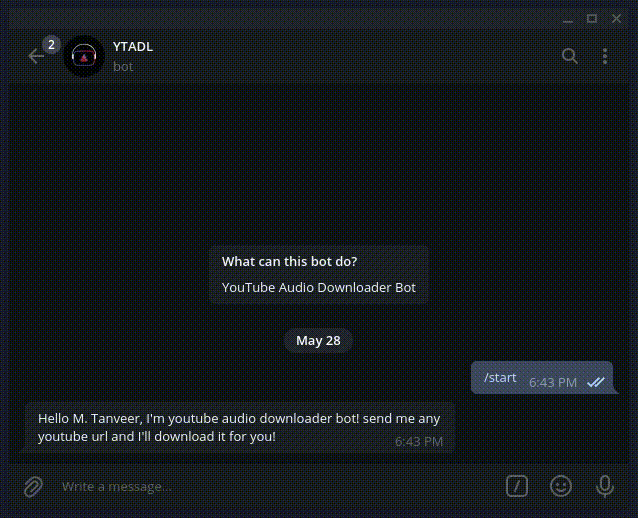

# Youtube Audio Downloader Bot  

A Telegram bot written in python that downloads music from YouTube and send it into the chat.  
  
## Working  
The bot filter out all the YouTube urls from the received message and send the downloaded audio back to the user. 
 

   
  
## Requirements  
1. [Pafy](https://pythonhosted.org/Pafy/)  
2. [python-telegram-bot](https://python-telegram-bot.org/)
3. urlextract  
4. requests  
5. hashlib  
6. [psycopg2](https://www.psycopg.org/)  
  
## Deploy the bot  
Create a bot on telegram using [@botfather](t.me/botfather)    
Create an app on [heroku](https://dashboard.heroku.com/)   
Create a public channel on telegram  
Set environment variables in heroku app  
- BOT_TOKEN = your bot API token  
- HEROKU_APP_NAME = name of your heroku app  
- POLLING : if you're running this on your local machine, please set POLLING = True else leave this if you're deploying on heroku  
- AUDIO_DB : PostgreSQL DB link for audio management
- USER_DB : PostgreSQL DB link for user management  
- OPEN_CHANNEL_USERNAME : Universal upload channel username, bot will upload files here and forward it to the user  
  
Deploy the bot [read here](https://devcenter.heroku.com/articles/getting-started-with-python)  

## Contributions 
1. [Icon by Alpha Designer](https://instagram.com/alpha_designer18)

## Future plans  
1. Making a desktop application that can be used by everyone on their machine by providing their bot API token
